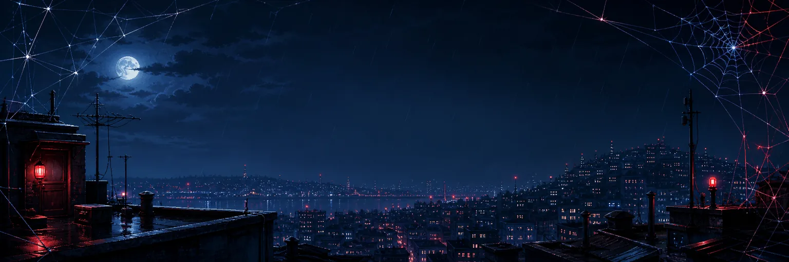
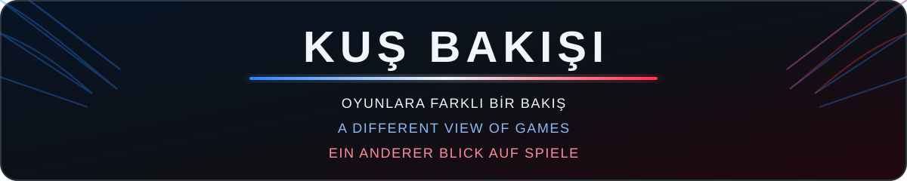
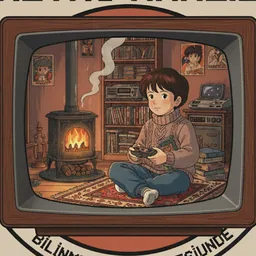

  
  

  

## Merhaba 👋

Ben **Kuş Bakışı**. Oyunları objektif bir bakışla inceliyor, ilk izlenimlerimi ve gerçek deneyimlerimi paylaşıyorum. Popüler olanın yanında gözden kaçan iyi oyunların da peşine düşüyorum. Burada YouTube videolarımın yanında, merak edip üzerinde çalıştığım oyun projelerini paylaşacağım.

  🐦 <em>Kuş Bakışı adı, 2020'de hayatıma giren sultan papağanından ve oyunlara farklı bir açıdan bakma fikrinden geliyor.</em>

## Hello 👋

I’m **Kuş Bakışı**. I review games from an honest perspective, share my first impressions and real experiences, and look beyond what is popular to find great games that may have been overlooked. Alongside my YouTube videos, I’ll use this space to share the game projects I explore and work on.

**Kuş Bakışı** means “bird’s-eye view” in Turkish and reflects my way of looking at games from a different angle. You can just call me **Birdman**.

## Hallo 👋

Ich bin **Kuş Bakışı**. Ich betrachte Spiele aus einer ehrlichen Perspektive, teile meine ersten Eindrücke und echten Erfahrungen und suche neben bekannten Titeln auch nach großartigen Spielen, die leicht übersehen werden. Neben meinen YouTube-Videos teile ich hier Spieleprojekte, die mich neugierig machen und an denen ich arbeite.

**Kuş Bakışı** bedeutet auf Türkisch „Vogelperspektive“ und steht für meinen Blick auf Spiele aus einem anderen Winkel. Ihr könnt mich einfach **Vogelmann** nennen.

## Spider-Man (2000) 🕸️

**Spider-Man (2000)** için hazırladığım ücretsiz fan projesi tamamlandı. Türkçe oyun metinlerinin yanında sinematikler ve oyun içi sahneler için Türkçe, İngilizce ve Almanca altyazılar içeriyor.

Orijinal oyunda altyazı desteği bulunmadığı için proje kendi görsel sahne tanıma sistemini kullanıyor. DuckStation'da oyun çalışırken oyun penceresindeki görüntüyü önceden hazırlanan sahne kareleriyle karşılaştırıyor ve tanıdığı sahneye ait altyazıyı doğru zamanda ekranın üzerine getiriyor. Sistem görüntü eşleştirmeye dayandığından nadiren yanlış bir sahneyi tanıyıp hatalı altyazı gösterebilir.

Kurulum için Windows'ta yalnızca **Setup** dosyasını, Ubuntu veya Debian tabanlı Linux dağıtımlarında ise **.deb** paketini kurmak yeterli. Ardından dili seçip oyunu başlatabilirsin.

  
<strong>English</strong>

   

My free fan project for **Spider-Man (2000)** is complete. It includes Turkish in-game text as well as Turkish, English, and German subtitles for cinematics and in-game scenes.

Since the original game has no subtitle support, the project uses its own visual scene recognition system. While the game is running in DuckStation, it compares the game window with prepared scene images and displays the matching subtitles on screen at the right time. Because it relies on image matching, it may occasionally recognize the wrong scene and show an incorrect subtitle.

On Windows, simply run the **Setup** file. On Ubuntu or Debian-based Linux distributions, install the **.deb** package. Then choose a language and start the game.

  
<strong>Deutsch</strong>

   

Mein kostenloses Fanprojekt für **Spider-Man (2000)** ist fertig. Es enthält türkische Spieltexte sowie türkische, englische und deutsche Untertitel für Zwischensequenzen und Spielszenen.

Da das Originalspiel keine Untertitel unterstützt, verwendet das Projekt ein eigenes System zur visuellen Szenenerkennung. Während das Spiel in DuckStation läuft, vergleicht es das Spielfenster mit vorbereiteten Szenenbildern und blendet die passenden Untertitel im richtigen Moment ein. Da das System auf Bildabgleichen basiert, kann es in seltenen Fällen eine falsche Szene erkennen und einen unpassenden Untertitel anzeigen.

Unter Windows genügt es, die **Setup-Datei** auszuführen. Unter Ubuntu- oder Debian-basierten Linux-Distributionen muss lediglich das **.deb-Paket** installiert werden. Danach Sprache auswählen und das Spiel starten.

## ⭐ Retroloji

<table>
  <tr>
    <td width="96" align="center">
      
    </td>
    <td>
      <a href="https://www.youtube.com/@retroloji"><strong>Retroloji</strong></a> 
      Geçmişimizi şekillendiren yapıtların izini süren retro kazıları. 
      
        Retro deep dives into the works that shaped our past and present. 
        Retro-Ausgrabungen zu Werken, die unsere Vergangenheit und Gegenwart geprägt haben.
      
    </td>
  </tr>
</table>

  Bu projedeki desteği için Retroloji'ye teşekkürler. 
  Thanks to Retroloji for supporting this project. • Danke an Retroloji für die Unterstützung dieses Projekts.

## ☕ Bir kahve ısmarla / Buy me a coffee / Spendier mir einen Kaffee

Bu projeyi beğendiysen ve bana bir kahve ısmarlamak istersen aşağıdaki destek bağlantısını kullanabilirsin. Destek tamamen isteğe bağlıdır; proje her zaman ücretsiz kalacak.

If you enjoyed this project and would like to buy me a coffee, you can use the support link below. Support is completely optional; the project will always remain free.

Wenn dir dieses Projekt gefällt und du mir einen Kaffee spendieren möchtest, kannst du den Unterstützungslink unten verwenden. Die Unterstützung ist vollkommen freiwillig; das Projekt bleibt immer kostenlos.

  

