

<strong>Bir dil seç / Choose a language / Sprache wählen</strong>

 

<strong>🇹🇷 Türkçe</strong>

 

## Merhaba 👋

Ben **Kuş Bakışı**. Oyunları objektif bir bakışla inceliyor, ilk izlenimlerimi ve gerçek deneyimlerimi paylaşıyorum. Popüler olanın yanında gözden kaçan iyi oyunların da peşine düşüyorum. Burada YouTube videolarımın yanında, merak edip üzerinde çalıştığım oyun projelerini paylaşıyorum.

🐦 <em>Kuş Bakışı adı, 2020'de hayatıma giren sultan papağanından ve oyunlara farklı bir açıdan bakma fikrinden geliyor.</em>

## Spider-Man (2000) 🕸️

### Bu proje nedir?

Bu, **Spider-Man (2000)** için hazırladığım ücretsiz bir fan projesi. Türkçe sürümde oyunun menüleri ve açıklamaları doğrudan düzenlenerek çevrildi. Türkçe, İngilizce ve Almanca sürümlerde video ara sahnelerine altyazılar eklendi.

Orijinal oyunda, oyun motoruyla gerçekleşen sahneler ve oyun sırasındaki konuşmalar için yerleşik bir altyazı sistemi bulunmuyor. Bu sahneler için oyunla birlikte otomatik çalışan Python tabanlı bir yardımcı yazılım kullanılıyor. Yazılım, DuckStation penceresindeki sahneyi tanıyor ve uygun altyazıyı doğru anda oyun görüntüsünün üzerine getiriyor. Böylece video ara sahnelerindeki altyazılar doğrudan oyun dosyasındaki videolarda yer alırken, oyun motoruyla gerçekleşen sahnelerin altyazıları canlı olarak gösteriliyor.

<strong>Nasıl çalışıyor?</strong>

 

- Video ara sahnelerinin altyazıları doğrudan oyun dosyasındaki videolara eklenmiştir.
- Oyun motoruyla gerçekleşen sahneler, önceden hazırlanmış görsel eşleşmelerle tanınır.
- Eşleşen sahnenin Türkçe, İngilizce veya Almanca altyazısı ekranda canlı olarak gösterilir.
- Dil seçimi launcher üzerinden yapılır ve canlı altyazı sistemi oyunla birlikte otomatik başlar.
- Görüntü eşleştirmeye dayandığı için çok nadir durumlarda yanlış sahne algılanabilir.

### 🖼️ Ekran görüntüleri

#### 🎞️ Video ara sahnesi

Video ara sahnelerindeki altyazılar doğrudan oyun dosyasındaki videolara eklenmiştir.

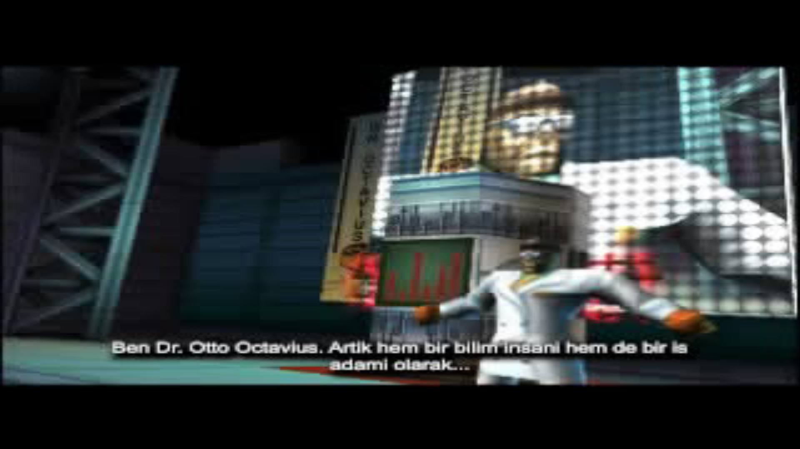

#### 🎮 Canlı oyun içi altyazılar

Oyun motoruyla gerçekleşen sahnelerdeki altyazılar, Windows ve Linux sürümleriyle birlikte çalışan canlı altyazı sistemi tarafından oyun görüntüsünün üzerine getiriliyor.

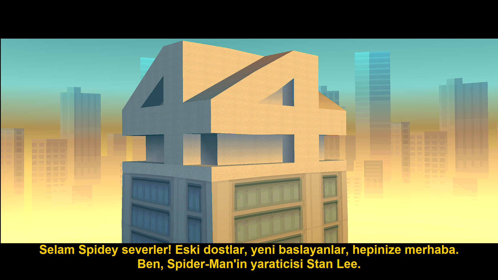
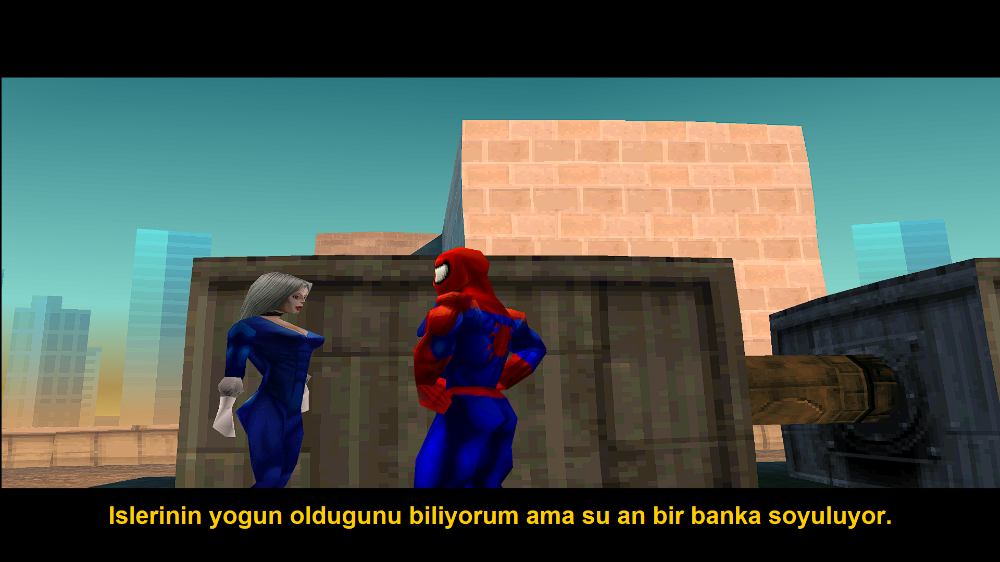

#### 🕹️ Türkçe arayüz

Türkçe sürümden bir menü örneği:

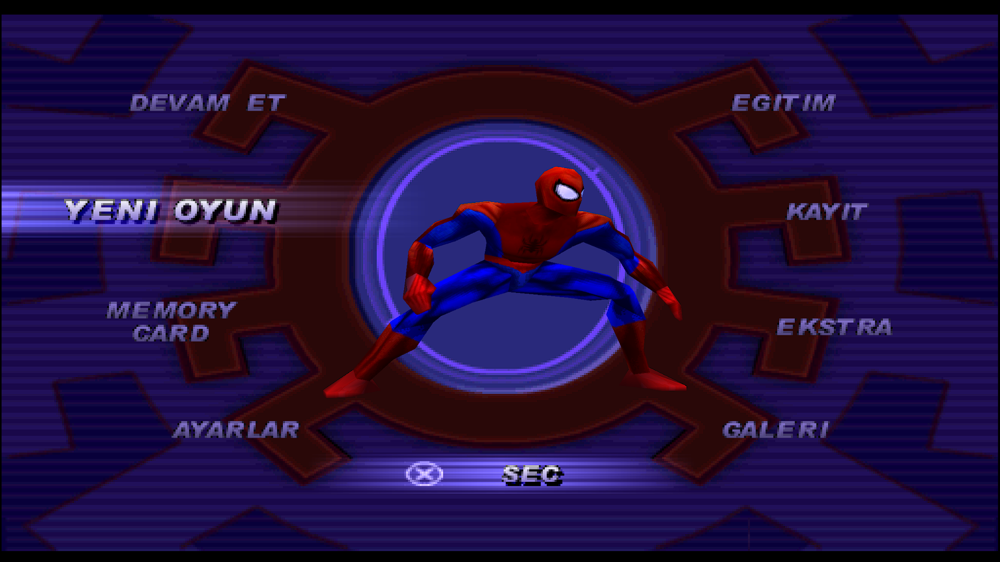

### İndir

Windows için kurulum paketi hazır. İndirme sayfasındaki dosyaları aynı klasöre indirip **Setup.exe** dosyasını çalıştırman yeterli.

Linux için **.deb** paketi parçalar hâlinde sunuluyor. İndirme sayfasındaki talimatları takip ederek parçaları birleştirebilirsin.

Her iki sürümde de kurulum sırasında kendi uyumlu oyun BIN dosyanı ve PlayStation BIOS dosyanı seçmen gerekir.

&nbsp;&nbsp;&nbsp;

  

#### 🎮 PS1 / PS2 / PS3 ve elle kurulum

PlayStation konsollarında, uyumlu emülatörlerde veya kendi tercih ettiği yöntemle oynamak isteyenler için bağımsız xdelta yamaları da bulunuyor.

xdelta dosyaları oyunun kendisi değildir. Uyumlu yamayı bir xdelta programıyla kendi değiştirilmemiş oyun BIN dosyana uygulaman gerekir.

Konsollarda Python tabanlı canlı altyazı yazılımı çalışmadığı için video ara sahnelerindeki altyazılar görüntülenir; oyun motoruyla gerçekleşen konuşmalı sahnelerdeki canlı altyazılar ise kullanılamaz. Türkçe xdelta yaması ayrıca Türkçe menüleri ve açıklamaları içerir.

### Gerekli dosyalar

Bu proje oyun veya PlayStation BIOS dosyalarını içermez. Oynamak için uyumlu bir oyun BIN dosyasına ve PlayStation 1 BIOS dosyasına sahip olman gerekir. İlk kurulum sırasında bu dosyaları seçmen yeterlidir.

Türkçe ve İngilizce sürümler için **SLES-02886**, Almanca sürüm için **SLES-02888** kullanılır.

### Kaynak kodu

Bu proje için geliştirdiğim launcher, oyun dosyası doğrulama sistemi ve canlı altyazı yazılımının kaynak kodları bu depoda **MIT Lisansı** altında yayımlanmıştır.

- [Kaynak kodunu incele](./src)
- [Kaynak paketi hakkında bilgi](./SOURCE_CODE.md)
- [MIT Lisansı](./LICENSE)
- [Üçüncü taraf bildirimleri](./NOTICE.md)

MIT Lisansı yalnızca bu proje için geliştirdiğim özgün kaynak kodları kapsar. Oyun, PlayStation BIOS dosyaları, DuckStation, Spider-Man markası ve üçüncü taraflara ait diğer materyaller bu lisans kapsamında değildir.

## 🌟 Özel Teşekkürler

<h3>
<a href="https://www.youtube.com/@retroloji">Retroloji</a>
</h3>

<em>Geçmişimizi ve bugünümüzü şekillendiren yapıtların izini süren retro kazıları.</em>

Bu projenin hazırlanma sürecinde verdiği değerli destek için 
<strong>Retroloji'ye içten teşekkürler.</strong>

Projeye verdiği destek ve retro oyun kültürüne sunduğu katkılar benim için çok değerli.

## ☕ Bir kahve ısmarla

Bu projeyi beğendiysen ve bana bir kahve ısmarlamak istersen aşağıdaki destek bağlantısını kullanabilirsin. Destek tamamen isteğe bağlıdır; proje her zaman ücretsiz kalacak.

<strong>🇬🇧 English</strong>

 

## Hello 👋

I'm **Kuş Bakışı**. I review games from an honest perspective, share my first impressions and real experiences, and look beyond what is popular to find great games that may have been overlooked. Alongside my YouTube videos, I share the game projects I explore and work on.

**Kuş Bakışı** means “bird's-eye view” in Turkish. The name was inspired by the cockatiel that has been by my side since 2020, and by the idea of looking at games from a different angle. You can simply call me **Birdman**.

## Spider-Man (2000) 🕸️

### What is this project?

This is my free fan project for **Spider-Man (2000)**. The Turkish version directly translates the game's menus and descriptions. Turkish, English and German subtitles have also been added to the video cutscenes.

The original game has no built-in subtitle system for scenes rendered by the game engine or dialogue heard during gameplay. These scenes are handled by a Python-based companion app that starts automatically with the game. The app recognises the current scene in the DuckStation window and displays the matching subtitle at the right moment. Video cutscene subtitles are added directly to the videos in the game image, while subtitles for scenes rendered by the game engine are displayed live by the companion app.

<strong>How does it work?</strong>

 

- Video cutscene subtitles are added directly to the videos stored in the game image.
- Scenes rendered by the game engine are recognised through prepared visual matches.
- The matching Turkish, English or German subtitle is displayed live on screen.
- The launcher selects the language and starts the live subtitle system automatically.
- Because it relies on image matching, the system may very rarely recognise the wrong scene.

### 🖼️ Screenshots

#### 🎞️ Video cutscenes

Subtitles for video cutscenes are added directly to the videos stored in the game image.

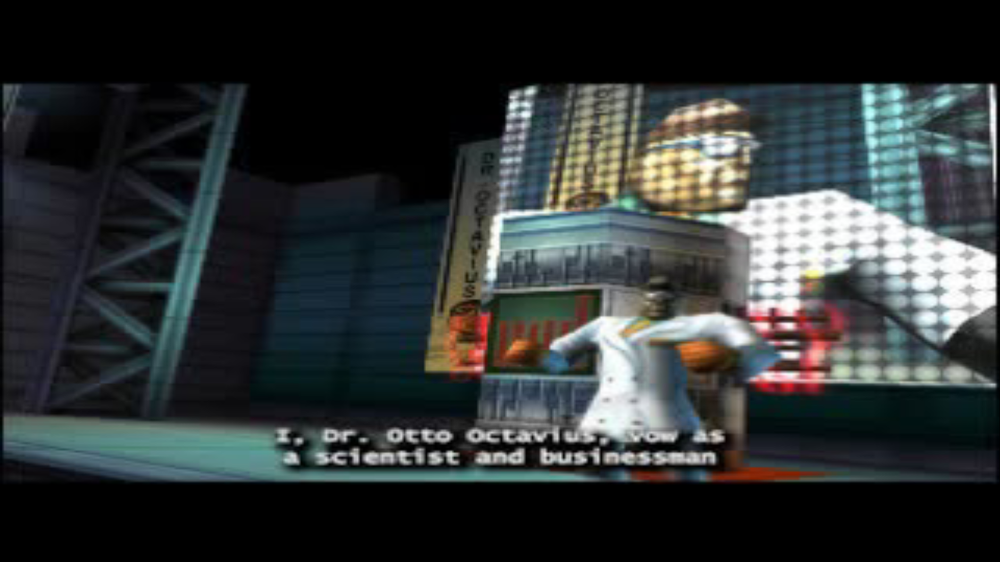
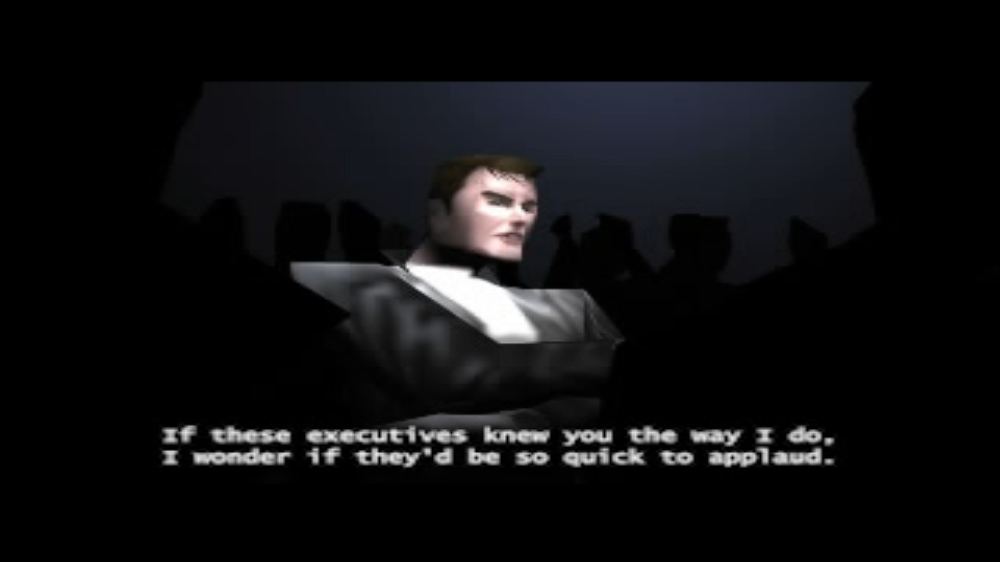

#### 🎮 Live in-game subtitles

The original game has no built-in subtitle support for scenes rendered by the game engine. In the Windows and Linux versions, these subtitles are displayed over the game by the live subtitle system.

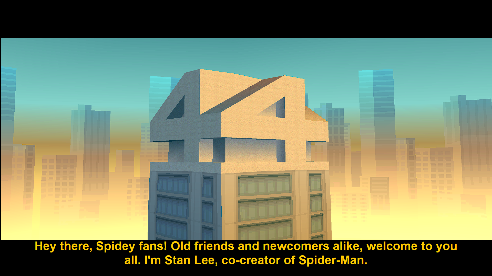
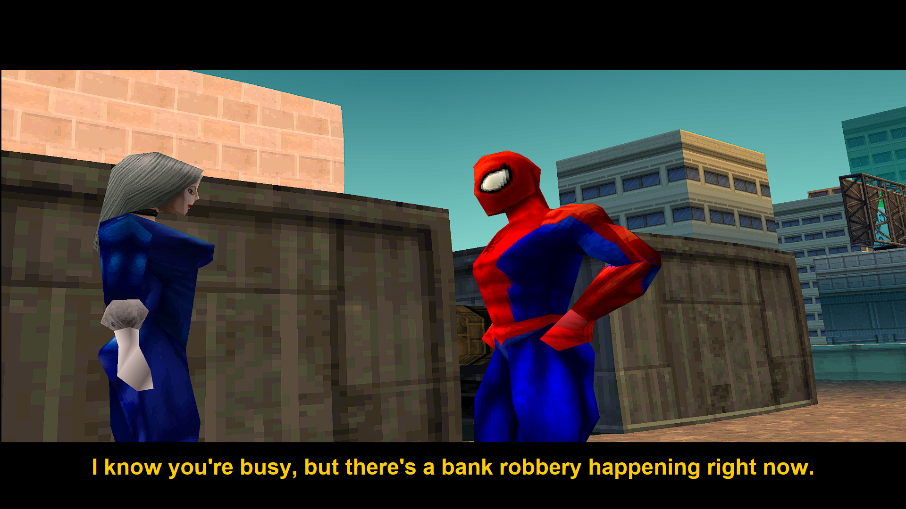

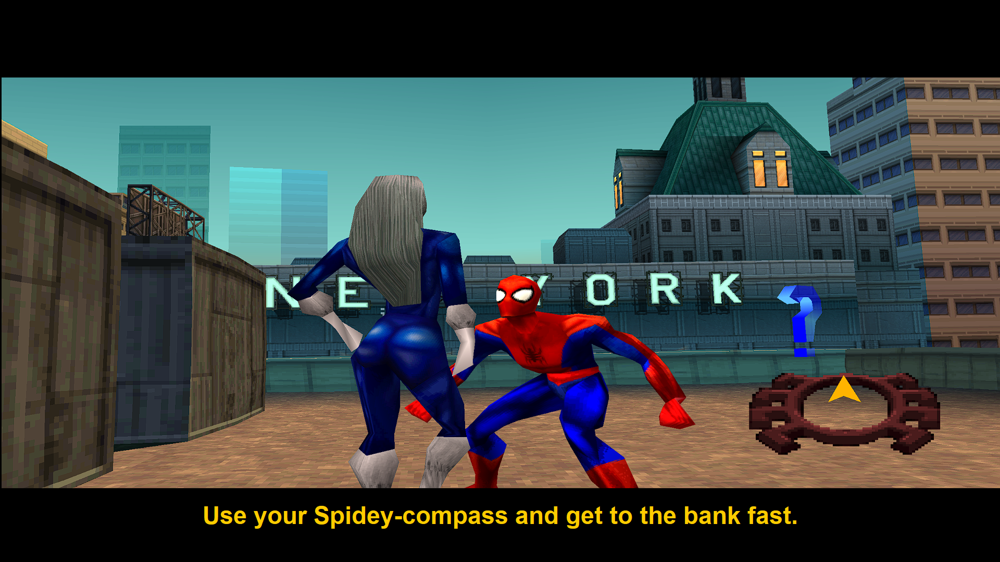

### Download

The Windows setup package is ready. Download the files from the release page into the same folder, then run **Setup.exe**.

For Linux, the **.deb** package is provided in split parts. Follow the instructions on the release page to merge them.

During setup, you will need to select your own compatible game BIN file and PlayStation BIOS.

&nbsp;&nbsp;&nbsp;

  

#### 🎮 PS1 / PS2 / PS3 and manual installation

Standalone xdelta patches are available for users who want to play on a PlayStation console, a compatible emulator or another supported environment.

The xdelta files are not complete game images. Apply the appropriate patch to your own unmodified game BIN file using a compatible xdelta patching program.

The Python-based live subtitle software cannot run on PlayStation consoles. As a result, subtitles added directly to the video cutscenes will be displayed, while live subtitles for dialogue scenes rendered by the game engine will not be available.

### Required files

This project does not include the game or any PlayStation BIOS files. You need a compatible game BIN file and a PlayStation 1 BIOS file to play. Simply select them during the first setup.

Use **SLES-02886** for Turkish and English, and **SLES-02888** for German.

### Source code

The source code I developed for the launcher, game-file verification system and live subtitle software is available in this repository under the **MIT License**.

- [Browse the source code](./src)
- [About the source package](./SOURCE_CODE.md)
- [MIT License](./LICENSE)
- [Third-party notices](./NOTICE.md)

The MIT License applies only to the original source code I developed for this project. The game, PlayStation BIOS files, DuckStation, the Spider-Man property and other third-party materials are not covered by this license.

## 🌟 Special Thanks

<h3>
<a href="https://www.youtube.com/@retroloji">Retroloji</a>
</h3>

<em>Retro deep dives into the works that shaped our past and present.</em>

A sincere thank-you to <strong>Retroloji</strong> 
for the valuable support given during the development of this project.

The support for this project and the contribution to retro gaming culture mean a great deal to me.

## ☕ Buy me a coffee

If you enjoyed this project and would like to buy me a coffee, you can use the support link below. Support is completely optional; the project will always remain free.

<strong>🇩🇪 Deutsch</strong>

 

## Hallo 👋

Ich bin **Kuş Bakışı**. Ich betrachte Spiele aus einer ehrlichen Perspektive, teile meine ersten Eindrücke und echten Erfahrungen und suche neben bekannten Titeln auch nach großartigen Spielen, die leicht übersehen werden. Neben meinen YouTube-Videos teile ich Spieleprojekte, die mich neugierig machen und an denen ich arbeite.

**Kuş Bakışı** bedeutet auf Türkisch „Vogelperspektive“. Der Name wurde von meinem Nymphensittich inspiriert, der seit 2020 an meiner Seite ist, sowie von der Idee, Spiele aus einem anderen Blickwinkel zu betrachten. Du kannst mich einfach **Vogelmann** nennen.

## Spider-Man (2000) 🕸️

### Was ist dieses Projekt?

Dies ist mein kostenloses Fanprojekt für **Spider-Man (2000)**. In der türkischen Version wurden die Menüs und Beschreibungen direkt übersetzt. Außerdem wurden den Video-Zwischensequenzen türkische, englische und deutsche Untertitel hinzugefügt.

Das Originalspiel besitzt kein integriertes Untertitel-System für Szenen, die von der Spielengine dargestellt werden, oder für Dialoge während des Spiels. Für diese Szenen wird eine Python-basierte Begleitsoftware verwendet, die automatisch zusammen mit dem Spiel startet. Sie erkennt die aktuelle Szene im DuckStation-Fenster und blendet den passenden Untertitel im richtigen Moment ein. Die Untertitel der Video-Zwischensequenzen sind direkt in die Videos der Spieldatei eingefügt, während die Untertitel der von der Spielengine dargestellten Szenen live von der Begleitsoftware angezeigt werden.

<strong>Wie funktioniert es?</strong>

 

- Die Untertitel der Video-Zwischensequenzen sind direkt in die Videos der Spieldatei eingefügt.
- Von der Spielengine dargestellte Szenen werden anhand vorbereiteter visueller Vergleichsdaten erkannt.
- Der passende türkische, englische oder deutsche Untertitel wird live eingeblendet.
- Der Launcher wählt die Sprache und startet das Live-Untertitel-System automatisch.
- Da das System auf Bildabgleichen basiert, kann es sehr selten eine falsche Szene erkennen.

### 🖼️ Screenshots

#### 🎞️ Video-Zwischensequenzen

Die Untertitel der Video-Zwischensequenzen sind direkt in die Videos der Spieldatei eingefügt.

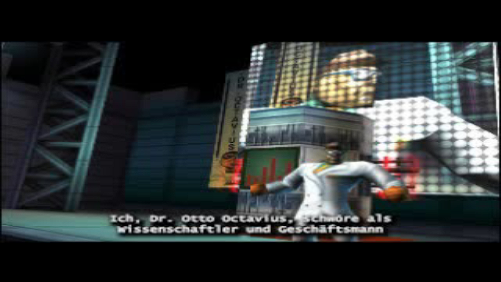
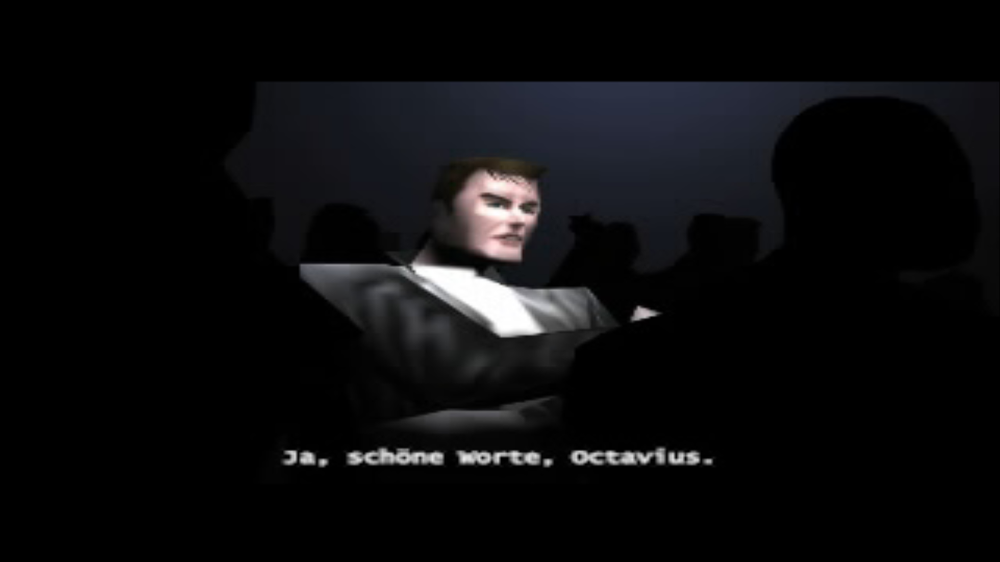

#### 🎮 Live-Untertitel in Spielszenen

Das Originalspiel besitzt keine integrierte Untertitel-Unterstützung für Szenen, die von der Spielengine dargestellt werden. In den Windows- und Linux-Versionen werden diese Untertitel vom Live-Untertitel-System über dem Spielbild angezeigt.

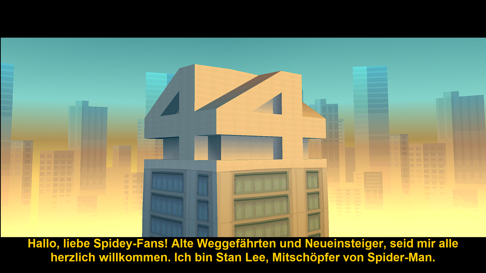
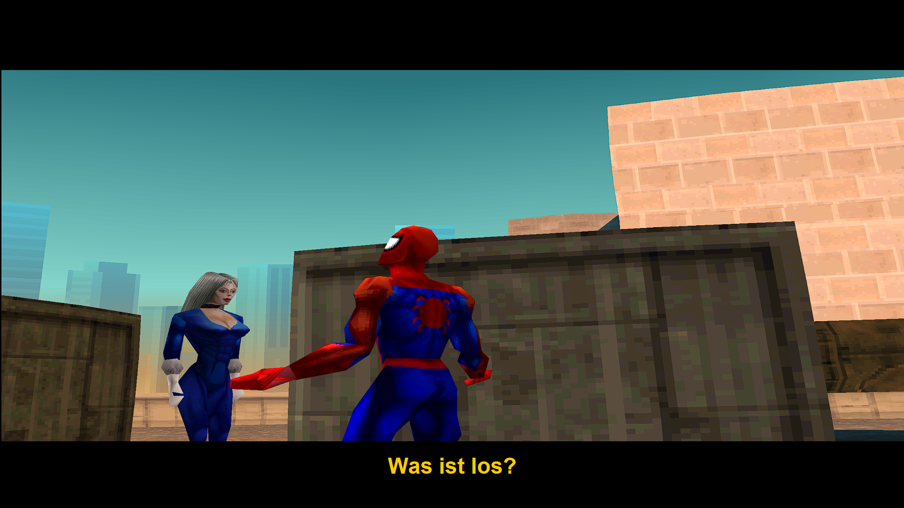

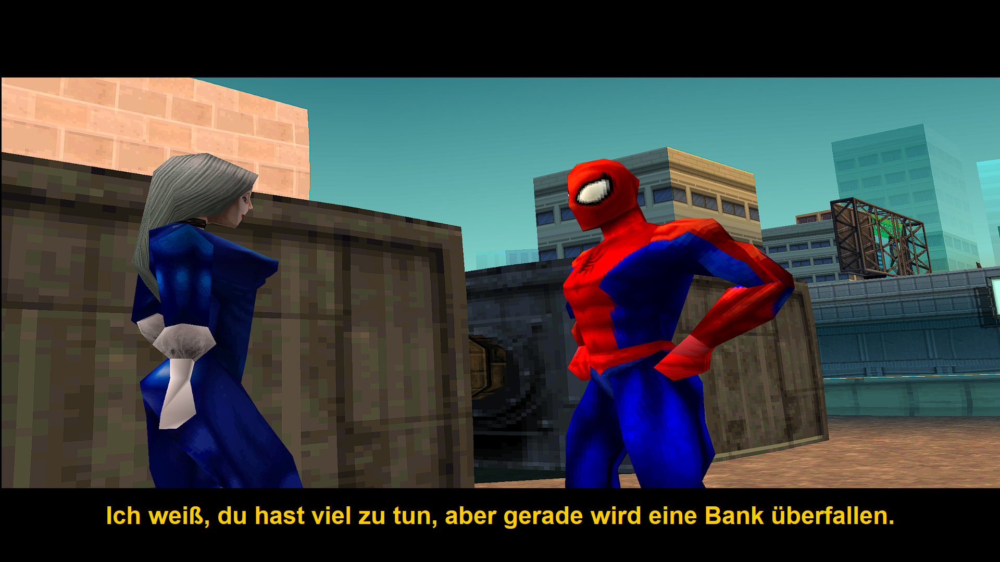

### Herunterladen

Das Windows-Setup-Paket ist bereit. Lade die Dateien von der Release-Seite in denselben Ordner herunter und starte anschließend **Setup.exe**.

Für Linux wird das **.deb**-Paket in mehreren Teilen bereitgestellt. Folge den Anweisungen auf der Release-Seite, um die Teile zusammenzufügen.

Während der Einrichtung musst du deine eigene kompatible BIN-Datei des Spiels und dein PlayStation-BIOS auswählen.

&nbsp;&nbsp;&nbsp;

  

#### 🎮 PS1 / PS2 / PS3 und manuelle Installation

Für Benutzer, die auf einer PlayStation-Konsole, einem kompatiblen Emulator oder in einer anderen unterstützten Umgebung spielen möchten, stehen eigenständige xdelta-Patches zur Verfügung.

Die xdelta-Dateien sind keine vollständigen Spielabbilder. Wende den passenden Patch mit einem kompatiblen xdelta-Programm auf deine eigene unveränderte Spiel-BIN-Datei an.

Die Python-basierte Live-Untertitel-Software kann nicht auf PlayStation-Konsolen ausgeführt werden. Deshalb werden die direkt in die Video-Zwischensequenzen eingefügten Untertitel angezeigt, während Live-Untertitel für von der Spielengine dargestellte Dialogszenen nicht verfügbar sind.

### Benötigte Dateien

Dieses Projekt enthält weder das Spiel noch PlayStation-BIOS-Dateien. Zum Spielen benötigst du eine kompatible BIN-Datei des Spiels und eine PlayStation-1-BIOS-Datei. Bei der ersten Einrichtung wählst du diese einfach aus.

Für Türkisch und Englisch wird **SLES-02886**, für Deutsch **SLES-02888** benötigt.

### Quellcode

Der von mir entwickelte Quellcode für den Launcher, das System zur Überprüfung der Spieldatei und die Live-Untertitel-Software ist in diesem Repository unter der **MIT-Lizenz** verfügbar.

- [Quellcode ansehen](./src)
- [Informationen zum Quellcode-Paket](./SOURCE_CODE.md)
- [MIT-Lizenz](./LICENSE)
- [Hinweise zu Drittanbieter-Komponenten](./NOTICE.md)

Die MIT-Lizenz gilt ausschließlich für den von mir für dieses Projekt entwickelten ursprünglichen Quellcode. Das Spiel, PlayStation-BIOS-Dateien, DuckStation, die Spider-Man-Marke und andere Materialien von Drittanbietern fallen nicht unter diese Lizenz.

## 🌟 Besonderer Dank

<h3>
<a href="https://www.youtube.com/@retroloji">Retroloji</a>
</h3>

<em>Retro-Ausgrabungen zu Werken, die unsere Vergangenheit und Gegenwart geprägt haben.</em>

Ein herzliches Dankeschön an <strong>Retroloji</strong> 
für die wertvolle Unterstützung bei der Entwicklung dieses Projekts.

Die Unterstützung dieses Projekts und der Beitrag zur Retro-Gaming-Kultur bedeuten mir sehr viel.

## ☕ Spendier mir einen Kaffee

Wenn dir dieses Projekt gefällt und du mir einen Kaffee spendieren möchtest, kannst du den Unterstützungslink unten verwenden. Die Unterstützung ist vollkommen freiwillig; das Projekt bleibt immer kostenlos.

